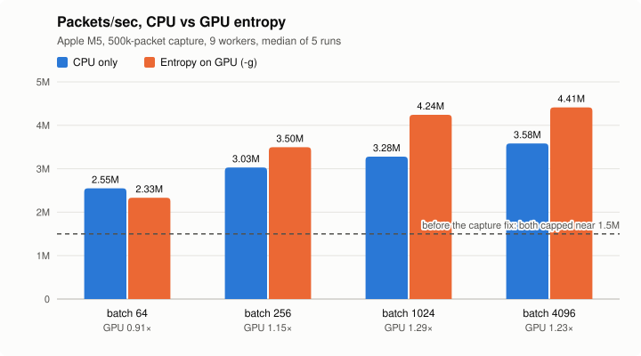

# NetSentinel

A multithreaded network traffic anomaly detector in C++17, with an
optional Apple Metal GPU path. It captures packets with libpcap (live or
from a .pcap file), parses the Ethernet/IPv4/TCP/UDP headers by hand, and
flags port scans, SYN floods, high-entropy payloads and known-bad
signatures. Entropy can run on the CPU or on the GPU, and a reproducible
benchmark compares the two.

**Result on an Apple M5:** up to **4.48M packets/sec** end to end with
entropy on the GPU, against **3.58M** for the best CPU-only setting
(1.25×), with identical alerts in all 160 benchmark runs.



The GPU wins once batches reach 256 packets; at 64 each dispatch's fixed
cost (~0.22 ms) outweighs the work. Getting here took three rounds of
measurement: the GPU first *lost* (0.84–0.96×), because a system call on
every packet in the capture loop capped both modes near 1.5M packets/sec.
The whole story, with methodology and raw data, is in
[docs/BENCHMARK.md](docs/BENCHMARK.md).

## Quick start

Requires CMake 3.20+, a C++17 compiler and libpcap (built into macOS;
`sudo apt-get install libpcap-dev` on Linux).

```sh
cmake -S . -B build -DCMAKE_BUILD_TYPE=Release
cmake --build build
ctest --test-dir build

python3 scripts/gen_synthetic_attacks.py -o demo.pcap
./build/netsentinel -r demo.pcap         # replay a capture: one alert per rule
sudo ./build/netsentinel -i en0          # live capture (Ctrl-C to stop)
```

On a Mac, add `-DNETSENTINEL_ENABLE_METAL=ON` for the GPU path (one-time
setup in [docs/METAL_SETUP.md](docs/METAL_SETUP.md)), then add `-g` to run
entropy on the GPU. A guided walkthrough is in [docs/DEMO.md](docs/DEMO.md).

## How it works

```
        libpcap: live interface (-i) or .pcap file (-r)
                            │
                  ┌─────────▼─────────┐
                  │  capture thread   │  parses headers by hand (bounds-checked),
                  └─────────┬─────────┘  copies each payload
                            │ push: blocks when full (backpressure, never drops)
                  ┌─────────▼─────────┐
                  │   bounded queue   │  mutex + condition variables, 4096 slots
                  └─────────┬─────────┘
                            │ pop_batch: up to -b packets, waits up to -L µs to fill
          ┌─────────────────┼─────────────────┐
     ┌────▼─────┐      ┌────▼─────┐      ┌────▼─────┐
     │ worker 1 │      │ worker 2 │  …   │ worker N │   N = cores − 1 (-w)
     └────┬─────┘      └────┬─────┘      └────┬─────┘
          └──────── analyze_batch() ──────────┘
            ├─ entropy ─────────► CPU, or Metal GPU (-g): one dispatch per batch
            ├─ signature hash        (these two run while the GPU works)
            └─ port scan, SYN flood ─► FlowTracker: per-IP state, 16 locked shards
                            │
                         alerts
```

- **Capture:** one thread reads packets through libpcap and parses the
  headers itself (network byte order, variable header lengths, every read
  bounds-checked against the captured length). The payload is copied
  because libpcap reuses its buffer for the next packet.
- **Queue:** bounded and blocking. A full queue slows capture down rather
  than dropping packets, so an overloaded detector can't silently miss an
  attack. Workers take packets in batches, and wait briefly to fill one,
  which is what makes one GPU dispatch per batch worthwhile.
- **Workers:** each runs every rule on its batch. Entropy goes through an
  `EntropyBackend`: the CPU one, or a Metal one that starts the GPU and
  lets the worker run the other rules before collecting the result. If a
  GPU dispatch fails, that batch falls back to the CPU and the run summary
  says so.
- **Shared state:** the port-scan and SYN-flood rules need per-source-IP
  history across all workers. `FlowTracker` splits it into 16 shards,
  each with its own lock, so unrelated IPs don't contend.

Every design decision, the alternatives considered and the measurements
behind them are in [docs/DESIGN.md](docs/DESIGN.md).

## Detection rules

Each worker runs `AnalysisEngine::analyze_batch()` on every batch it takes from the queue:

- **Port scan** — flags a source IP once it has sent connection attempts
  to N distinct destination ports within a trailing window (default: 10
  ports / 5s). A connection attempt is a TCP SYN without ACK, or a UDP
  datagram not sent from a well-known port (below 1024). Counting every
  packet instead flagged busy servers, whose replies go to hundreds of
  client ports: about 1,100 false alerts on the benchmark capture, now 0,
  with every real scan still caught.
- **SYN flood** — flags a source IP once it has N SYN packets with no
  completing ACK yet, within a trailing window (default: 20 / 2s). A
  legitimate client's own later ACK on the same 4-tuple clears its pending
  entry, so normal fast-but-real connections don't trip this.
- **High-entropy payload** — flags a payload whose Shannon entropy is at or
  above a threshold (default: 7.0 bits/byte out of a max of 8.0), meant to
  catch encrypted/compressed C2 or exfil traffic. Note: Shannon entropy
  computed over a *small* sample undercounts true randomness (a 128-byte
  random payload averages ~6.5 bits/byte, a 256-byte one ~7.2) — this is an
  inherent property of the technique, not a bug. The threshold (`-e`) and
  the minimum payload length (32 bytes) are tuning knobs.
- **Signature match** — hashes the payload (FNV-1a) and compares against a
  small built-in set of known-bad hashes (seeded with the EICAR antivirus
  test string, a standard harmless string for exercising exactly this).

### Resistance to the traffic it detects

A detector whose own bookkeeping degrades under attack traffic is a
liability, so two properties are treated as requirements, not
optimizations, and are covered by tests:

- **Per-packet work is O(1) amortized.** Both stateful rules keep their
  sliding windows as a FIFO plus live counts, so nothing rescans the
  window per packet. The naive version was quadratic: a sustained scan
  from one source took 51s for 40k packets and never finished 200k. It now
  runs 200k in 1.3s (~155k packets/sec) and scales linearly — a ~200x
  improvement at 40k packets, widening as traffic grows.
- **Tracked state is bounded.** Per-IP records are evicted once idle and
  hard-capped per shard, because a spoofed-source flood makes every record
  look "recent" and idle eviction alone would never fire. 200k packets
  from 200k unique source IPs previously grew to 187MB and never shrank;
  it now holds at ~52MB regardless of how long the flood runs.

Port scan and SYN flood need state per source IP shared across every
worker thread. That state lives in `FlowTracker`, a **sharded map**: each
shard has its own mutex, keyed by `hash(src_ip) % num_shards`, so unrelated
source IPs never contend and all of one IP's packets land in the same
shard. Packets from the same IP can still be split across concurrent
worker batches, so the *exact* timing/count of debounced alerts can vary
slightly run to run under different thread scheduling — but the underlying
per-IP state (which ports/SYNs fall inside the time window) is always
correct, since every access to it is mutex-protected.

Testing: real `nmap -sS` runs against a local target for port scan/SYN
flood (both fire correctly — an SYN scan is itself a mini SYN flood, since
it never completes handshakes), plus `scripts/gen_synthetic_attacks.py`
for reproducible offline testing, covering all four rules plus a
benign-traffic false-positive check (see [docs/DEMO.md](docs/DEMO.md)).

### Known limitations

Deliberate, understood trade-offs rather than oversights:

- **Spoofed-source SYN floods are not flagged.** The rule counts pending
  SYNs *per source IP*, as specified — but a real flood randomizes its
  source addresses precisely to defeat that, so each fake IP contributes
  one SYN and nothing crosses the threshold. Catching it needs a
  complementary per-*destination* half-open count. The tracker stays
  bounded under such a flood (above), it just won't alert on it.
- **Signature matching is whole-payload only.** Payloads are hashed
  entire, so a known-bad string *embedded* in a larger payload is missed.
  Catching that needs rolling-window hashing (Rabin-Karp). The current
  behaviour is pinned by a test so a future change is deliberate.
- **Entropy is per-packet, not per-flow.** Encrypted traffic split across
  many small packets may not trip a per-packet threshold (see the
  small-sample note above).
- **Alert timing is not deterministic under threading.** Packets from one
  source IP may land in different concurrent worker batches, so the exact
  count/timing of debounced alerts varies slightly run to run. The
  underlying per-IP state is always correct — every access is
  mutex-protected — only the alert cadence is loose. On the stress capture,
  all 20 scanning hosts are flagged at every batch size and worker count;
  only the number of repeat alerts changes.
- **UDP scans from a service port go unnoticed.** UDP has no handshake, so
  datagrams sent from a port below 1024 are treated as server replies and
  not counted toward the port-scan rule. A scanner that sends from such a
  port (e.g. `nmap --source-port 53`) evades the UDP half of the rule.
- **Encrypted traffic trips the entropy rule.** TLS payloads are
  indistinguishable from random bytes, so on real traffic the high-entropy
  alert fires on most full-size encrypted packets. On the benchmark capture
  that's about 188k of 500k packets. In a 71-second live capture of normal
  browsing on the M5, it was 373 of 1,227 packets, and every one was
  ordinary encrypted traffic (HTTPS on 443, DNS over TLS on 853, XMPP on
  5222). Entropy alone can't tell legitimate TLS from exfil; it needs
  context, such as flagging high entropy only on ports that normally carry
  plaintext.

## Command-line options

```
netsentinel -i <device> | -r <file.pcap> [options]
  -i <device>   capture live from a network interface
  -r <file>     replay packets from a .pcap file
  -c <count>    stop after this many parsed packets (0 = unlimited)
  -l            list available capture devices and exit
  -w <n>        worker thread count (default: cores - 1)
  -q <n>        bounded queue capacity (default: 4096)
  -b <n>        max packets a worker pops per batch (default: 64)
  -L <usec>     how long a worker waits to fill a batch (default: 2000)
  -v            print every packet, not just alerts
  -e <bits>     high-entropy alert threshold, bits/byte (default: 7.0)
  -g            compute entropy on the Metal GPU (Metal builds only)
  -s            silent: count alerts without printing them (for benchmarking)
```

After a run, netsentinel prints packets/sec, alerts by type, and how much
of the time the capture thread and the workers spent waiting on each
other, which shows which side limits throughput. Packets/sec is only
meaningful when replaying a file; in live capture it includes time spent
waiting for traffic. For GPU runs, `-b 1024` or more is where `-g` pays off.

## Building in more detail

### Tests

`ctest --test-dir build` runs six suites (five without Metal), with no
external test framework:

- **parser:** malformed input the parser must survive: truncated headers,
  a bogus IHL, a lying `total_length`, snaplen cuts.
- **analysis, analysis_engine, flow_tracker:** entropy values derivable by
  hand, and both directions of every rule: it fires on attacks and stays
  quiet on traffic that merely resembles them.
- **queue:** FIFO order, backpressure instead of dropping, a shutdown that
  drains, no packet loss across 3 producers and 4 consumers, batching.
- **gpu_entropy** (Metal builds): GPU results match the CPU within
  1.3e-6 bits/byte, including dispatches from 8 threads at once.

They also run clean under sanitizers:

```sh
cmake -S . -B build-asan -DCMAKE_CXX_FLAGS="-fsanitize=address,undefined" \
      -DCMAKE_EXE_LINKER_FLAGS="-fsanitize=address,undefined"
cmake -S . -B build-tsan -DCMAKE_CXX_FLAGS="-fsanitize=thread" \
      -DCMAKE_EXE_LINKER_FLAGS="-fsanitize=thread"
```

### macOS `/dev/bpf*` permission

Live capture on macOS reads from `/dev/bpf*`, which normal user accounts
can't open by default: `-l` lists nothing, or `-i` fails with a permission
error. Options, in order of convenience:

1. **Run with sudo** (`sudo ./build/netsentinel -i en0`): simplest, fine
   for development.
2. **One-off chmod**: `sudo chmod 644 /dev/bpf*` (resets on reboot).
3. **Persistent fix**: add your user to the `access_bpf` group, then log
   out and back in:
   ```sh
   sudo dseditgroup -o edit -a "$(whoami)" -t user access_bpf
   ```

Replaying a .pcap file (`-r`) needs no permissions.

### Metal GPU path

macOS on Apple Silicon only, behind the `NETSENTINEL_ENABLE_METAL` CMake
option, so the CPU version still builds everywhere. It needs Apple's
metal-cpp headers (setup in [docs/METAL_SETUP.md](docs/METAL_SETUP.md)):

```sh
cmake -S . -B build -DCMAKE_BUILD_TYPE=Release -DNETSENTINEL_ENABLE_METAL=ON
cmake --build build
./build/metal_smoke_test                   # checks the GPU path on its own
./build/netsentinel -r demo.pcap -g        # entropy on the GPU
```

### Benchmark

```sh
python3 scripts/run_benchmark.py                        # CPU vs GPU, by batch size
python3 scripts/run_benchmark.py --workers 3,4,6,9      # also compare worker counts
./build/bench_capture benchmark.pcap                    # capture thread alone, step by step
./build/bench_analysis benchmark.pcap                   # each rule alone, by thread count
python3 scripts/plot_benchmark.py                       # redraw docs/benchmark.svg
```

The first run generates `benchmark.pcap` (500k packets, seeded, so it's
identical every time). Details in [docs/BENCHMARK.md](docs/BENCHMARK.md).

## Project layout

```
src/capture/    libpcap wrapper, hand-written header parser
src/queue/      bounded packet queue, worker pool
src/analysis/   entropy, signatures, FlowTracker, AnalysisEngine, entropy backends
src/gpu/        Metal context, GPU entropy backend, smoke test
shaders/        Metal kernels (embedded into the binary at build time)
src/bench/      bench_entropy, bench_capture, bench_analysis
tests/          six test suites
scripts/        capture generators, benchmark runner, chart
docs/           design, benchmark, demo, Metal setup, build plan
```

## Non-goals (v1)

No distributed or multi-host capture, no ML-based detection, no dashboard
beyond console output, no parsing beyond Ethernet/IPv4/TCP/UDP headers.

## Project status

All phases of the build plan ([docs/PLAN.md](docs/PLAN.md)) are done:

- [x] Phase 0: setup and scaffolding
- [x] Phase 1: packet capture and parsing
- [x] Phase 2: thread pool and queue
- [x] Phase 3: CPU-only anomaly detection
- [x] Phase 4: Metal GPU kernel port
- [x] Phase 5: benchmark
- [x] Phase 6: docs and demo
